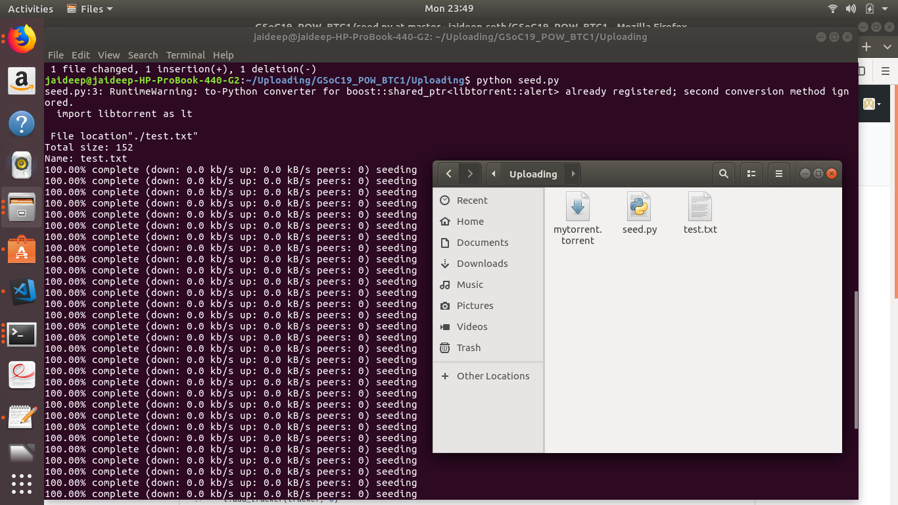

# GSoC 19 POW BitTorrent Client (1):
A Bit Torrent Client to create, seed and download from .torrent files!

## Getting Started

This will guide you through setting up this BT client, this repository is split into 2 parts:

####1) Uploading:
This involves creating .torrents from files/folders and seeding them to peers.

####2) Downloading:
This involves adding .torrent files into a BitTorrent Client GUI!

## Set it up!

### For Uploading:
P.S- No need to set up a Python virtual environment for "Uploading"

-Python Libtorrent used here!
```
sudo apt install python-libtorrent
```
-To create a .torrent file and start seeding of desired contents( specify file of choice, in this case the file is "./test.txt" as shown in image below).
```
python Uploading/seed.py
```
-Upon starting the seeding process a .torrent( mytorrent.torrent ) is created. Let the seeding process run indefinitely( Will specify duration on further testing!)



#### For Downloading:
### Installing

A step by step series of examples that tell you how to get a development env running

Say what the step will be

```
Give the example
```

And repeat

```
until finished
```

End with an example of getting some data out of the system or using it for a little demo

## Running the tests

Explain how to run the automated tests for this system

### Break down into end to end tests

Explain what these tests test and why

```
Give an example
```

### And coding style tests

Explain what these tests test and why

```
Give an example
```

## Deployment

Add additional notes about how to deploy this on a live system

## Built With

* [Dropwizard](http://www.dropwizard.io/1.0.2/docs/) - The web framework used
* [Maven](https://maven.apache.org/) - Dependency Management
* [ROME](https://rometools.github.io/rome/) - Used to generate RSS Feeds

## Contributing

Please read [CONTRIBUTING.md](https://gist.github.com/PurpleBooth/b24679402957c63ec426) for details on our code of conduct, and the process for submitting pull requests to us.

## Versioning

We use [SemVer](http://semver.org/) for versioning. For the versions available, see the [tags on this repository](https://github.com/your/project/tags). 

## Authors

* **Billie Thompson** - *Initial work* - [PurpleBooth](https://github.com/PurpleBooth)

See also the list of [contributors](https://github.com/your/project/contributors) who participated in this project.

## License

This project is licensed under the MIT License - see the [LICENSE.md](LICENSE.md) file for details

## Acknowledgments

* Hat tip to anyone whose code was used
* Inspiration
* etc

