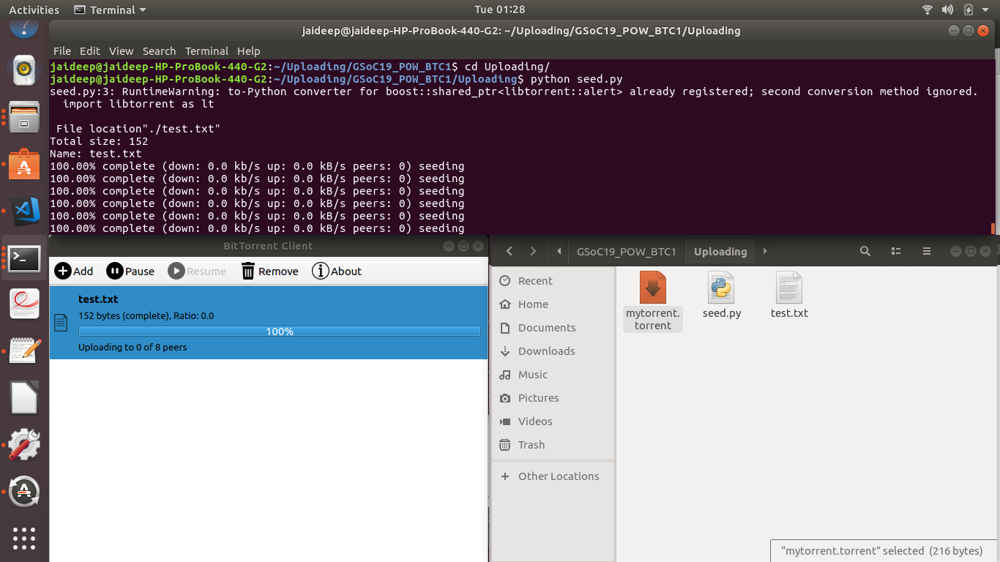

# GSoC 19 POW BitTorrent Client (1):
A Bit Torrent Client to create, seed and download from .torrent files!

## Getting Started

This will guide you through setting up this BT client, this repository is split into 2 parts:

#### 1) Uploading:
This involves creating .torrents from files/folders and seeding them to peers.

#### 2) Downloading:
This involves adding .torrent files into a BitTorrent Client GUI!

## Set it up!

### For Uploading:

-python libtorrent used here
```
sudo apt install python-libtorrent
```
-To create a .torrent file and start seeding of desired contents( specify file of choice, in this case the file is "./test.txt" as shown in image below).
```
python3 Uploading/seed.py
```
-Upon starting the seeding process a .torrent( mytorrent.torrent ) is created. Let the seeding process run indefinitely( Will specify duration on further testing!)


### For Downloading:
P.S- Install into Python Virtual Evironment.


-Install modules within requirements.txt
```
pip3 install -r requirements.txt 

```


Then run the BitTorrent Client GUI! (shown in image below).

```
python3 Downloading/bit-torrent/torrent_gui.py 
```
The process of running the GUI is shown here.


### Finally good to go!
Shown below is an image of the process of seeding contents, creating their .torrent file and adding this .torrent file into the BitTorrent GUI based client for downloading from peers.



## Acknowledgments

* [Borzunov](https://github.com/borzunov/bit-torrent) - The Downloading portion of client! 

## Other


* [Torrents](https://eztv.io/) - Webpage to access larger, better seeded content.

